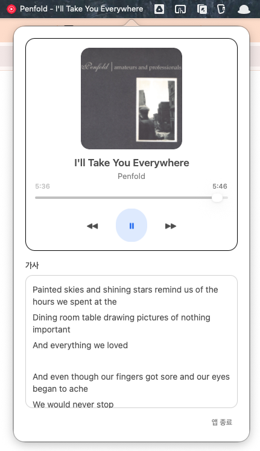

# YouTubeMusicMenuBar

Safari의 YouTube Music 탭 상태를 읽어 macOS 메뉴바에서 곡 정보를 표시하고, 팝오버에서 재생 제어/가사 확인을 할 수 있는 메뉴바 앱입니다.

## 프로젝트 소개
- 메뉴바에서 현재 곡 상태(아티스트 - 제목)를 빠르게 확인
- 팝오버에서 `이전 / 재생·일시정지 / 다음` 제어
- 현재 재생 위치 확인 및 시킹
- YouTube Music 페이지에서 읽어온 가사 확인
- 앱 종료 버튼 제공

## 스크린샷


## 주요 기능
- 메뉴바 아이콘 + 재생 정보 표시
  - 재생 중이면 `아티스트 - 제목` 표시
  - 재생 정보가 없으면 아이콘만 표시
- 팝오버 플레이어 UI
  - 앨범아트
  - 트랙 제목/아티스트
  - 시간 라벨(현재/전체) + 진행 슬라이더
  - 재생 컨트롤(이전/재생·일시정지/다음)
  - 가사 영역(스크롤)
  - 앱 종료
- Safari 탭 제어
  - AppleScript + JavaScript로 YouTube Music 탭 탐색/제어
- 빌드 산출물 자동 생성
  - `.app` 번들
  - 배포용 `.zip`

## 최근 개선 사항
- Soft-light 톤 기반 팝오버 UI 리디자인
- 팝업 위치 안정화
  - 메뉴바 아이템 우측 기준 고정 오프셋으로 앵커를 계산해 위치 흔들림 완화
- 초기 실행 시 앨범아트 누락 개선
  - 동일 URL 실패 케이스 재시도
  - 뷰 생성 시점 이미지 캐시 반영
- 가사 스크롤 떨림 개선
  - 가사 텍스트가 실제로 바뀐 경우에만 텍스트뷰 업데이트
- 재생 컨트롤 클릭 피드백 추가
  - 과하지 않은 눌림 애니메이션(scale/opacity)
- 빌드 스크립트 개선
  - Core Animation 링크를 위해 `QuartzCore` 프레임워크 포함

## 빌드
```bash
# 레포 루트에서 실행
./Scripts/build.sh
```

산출물:
- `Build/YouTubeMusicMenuBar.app`
- `Dist/YouTubeMusicMenuBar.zip`

## 설치
```bash
cp -R "./Build/YouTubeMusicMenuBar.app" /Applications/
```

## 업데이트
기존 `/Applications` 앱을 최신 빌드로 덮어쓰려면:

```bash
ditto "./Build/YouTubeMusicMenuBar.app" "/Applications/YouTubeMusicMenuBar.app"
```

필요 시 실행 중인 앱 종료 후 다시 실행:

```bash
killall YouTubeMusicMenuBar || true
open "/Applications/YouTubeMusicMenuBar.app"
```

## 권한
최초 실행 시 macOS에서 Apple Events 권한을 요청할 수 있습니다.

- 경로: `System Settings > Privacy & Security > Automation`
- Safari 제어 권한 허용 필요

## 트러블슈팅
### 1) 팝업 위치가 곡 제목 길이에 따라 흔들림
- 원인: 메뉴바 텍스트 폭 변화에 팝업 기준이 영향 받음
- 현재: 메뉴바 아이템 기준 고정 오프셋 앵커로 표시하도록 개선

### 2) 앱 최초 실행 시 앨범아트 누락
- 원인: 초기 로드 실패 후 동일 URL 재시도 누락, 뷰 생성 타이밍 이슈
- 현재: 재시도 로직 + 이미지 캐시 반영으로 개선

### 3) 가사 스크롤이 멈춘 뒤 위치가 미세하게 바뀜
- 원인: 주기적 상태 갱신 시 가사 텍스트를 매번 재적용
- 현재: 텍스트 변경 시에만 업데이트하도록 개선

### 4) 재생 버튼을 눌렀을 때 반응감 부족
- 원인: 클릭 시 시각 피드백 부재
- 현재: 이전/재생/다음 버튼에 짧은 눌림 애니메이션 추가

## 배포 검토(실배포)
현재는 ad-hoc 서명 상태이며 개인 사용에는 충분합니다. 외부 배포 시 아래 작업이 필요합니다.

1. Apple Developer ID Application 인증서로 정식 서명
2. Hardened Runtime 옵션 적용
3. Notarization (`xcrun notarytool`) 통과
4. Stapling (`xcrun stapler`) 수행

## 아이콘 참고
- 런타임에서 공식 YouTube Music favicon(`music.youtube.com/img/favicon_144.png`) 로드 시도
- 오프라인/차단 환경 대비: 빌드 시 생성한 대체 아이콘 사용
